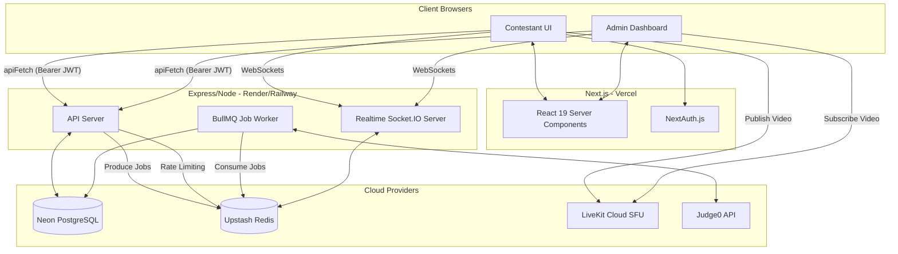

# System Architecture

ByteArena is built on a scalable microservices architecture optimized for free-tier cloud deployments while maintaining enterprise-grade resilience.

---

## 📐 High-Level Architecture Diagram

---

## ☁️ Deployment Strategy

The architecture is strictly separated to maximize the use of specialized cloud platforms.

### 1. Frontend (Deployed to Vercel)
* Vercel acts as the CDN and Serverless environment for Next.js.
* **Responsibilities**: Serves static assets, handles SSR/SSG rendering, and manages NextAuth login flows. 
* **Environment Variables**: Inject URLs pointing to the API, Realtime, and LiveKit servers.

### 2. API Server (Deployed to Render or Railway)
* **Responsibilities**: Heavy business logic, CRUD, JWT verification, and BullMQ worker processing.
* **Reasoning**: Unlike Vercel's serverless functions (which time out after 10-60s), Render/Railway provides a persistent container environment necessary for background queue processing and stable Express rate-limiting.

### 3. Realtime Server (Deployed to Render or Railway)
* **Responsibilities**: Socket.IO connection pooling and state synchronization.
* **Reasoning**: WebSockets require long-lived TCP connections, which Serverless architectures (like Vercel) drop.

### 4. Database (Deployed to Neon)
* **Responsibilities**: Relational data integrity (Users, Contests, Questions, Submissions).
* **Reasoning**: Serverless Postgres scales compute to zero when inactive and handles connection pooling gracefully.

### 5. Redis (Deployed to Upstash or Railway)
* **Responsibilities**: 
  - Socket.IO Adapter Backplane (syncs socket events across nodes)
  - BullMQ Queue Storage (Judge execution queues)
  - IP-based Rate Limiting Storage
  - Volatile Presence TTLs (Tracking active users)

### 6. Streaming Engine (Deployed to LiveKit Cloud)
* **Responsibilities**: Selective Forwarding Unit (SFU) for WebRTC.
* **Reasoning**: Using P2P WebRTC to stream 100 contestants to 1 admin requires $N \times 100$ concurrent connections, crashing the browser. LiveKit acts as a middleman—contestants upload 1 stream to the cloud, and the admin downloads 1 multiplexed stream, ensuring $O(1)$ client bandwidth.
